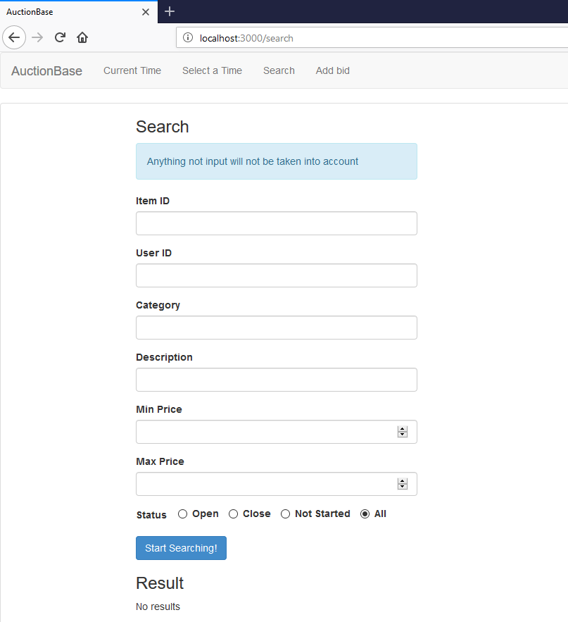

# AuctionBase
Final Project for cs 145: http://web.stanford.edu/class/cs145/
http://github.com/stanford-futuredata/cs145-2017

excecute runParser.sh to transform JSON data into SQlite load files  
execute createDatabase.sh to create and populate database  
copy auction.db to web.py dir  
excecute command:  
python auctionbase.py 3000  
go to: localhost:3000/search  

